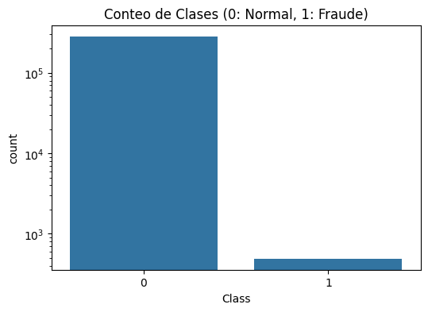
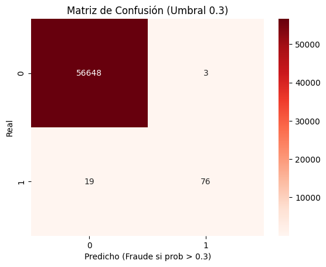
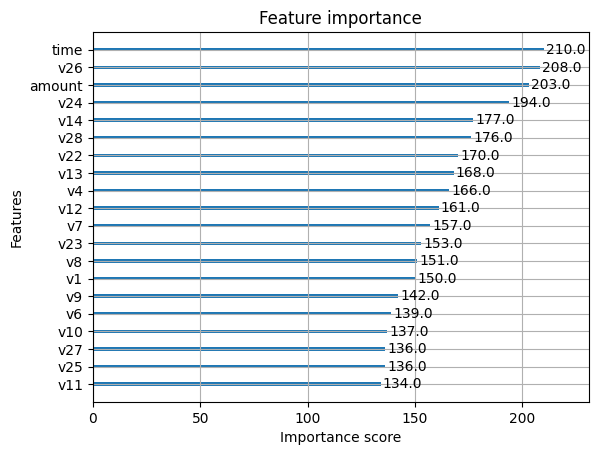

# Credit Card Fraud Detection
**Dataset:** [Kaggle - Credit Card Fraud](https://www.kaggle.com/datasets/mlg-ulb/creditcardfraud?select=creditcard.csv)

##  Descripción del Proyecto
Detección de fraude en tarjetas de crédito e implementación de modelos. Se realizó la implementación de un modelo predictivo de transacciones fraudulentas utilizando el modelo **XGBoost**, optimizado para el manejo de desbalances.

En el sector bancario existen diariamente una gran cantidad de movimientos financieros con respecto a tarjetas de crédito. Con tanto movimiento, existen transacciones fraudulentas que le generan a los bancos pérdidas significativas y generan a los usuarios implicados desconfianza.

**Desafíos técnicos:** El dataset está altamente desbalanceado, lo que requirió un manejo meticuloso a la hora de crear el modelo para evitar que la clase mayoritaria sesgara los resultados.


##  Stack Tecnológico
*   **Lenguaje:** Python 3.10.20
*   **Entorno:** Ubuntu
*   **Librerías principales:**
    *   **Análisis y Manipulación:** Pandas (estructuras tabulares) y NumPy (computación numérica).
    *   **Visualización Estadística:** Matplotlib y Seaborn.
    *   **Machine Learning:** Scikit-learn (Regresión Logística, RobustScaler, GridSearchCV/RandomizedSearchCV) y XGBoost.

##  Estructura del Repositorio
```text
├── data/               # Datasets originales y procesados
├── notebooks/          # Exploratory Data Analysis (EDA) y Modelado
├── src/                # Scripts de preprocesamiento y entrenamiento
├── models/             # El archivo .json o .pkl del modelo entrenado
├── README.md           # Documentación principal
└── requirements.txt    # Dependencias del proyecto
```

##  Análisis Realizado (EDA)


*   Privacidad y PCA: El dataset no ofrece información de las columnas por privacidad. Se encuentra escalado y también tiene implementado PCA, según lo que informa el proveedor del dataset. Además, en el diagrama de calor observé que no hay relaciones fuertes entre variables, indicando que probablemente ya pasó por un proceso de PCA.

* Calidad de Datos: El dataset no presenta valores nulos.

* Desequilibrio: Tiene un alto desequilibrio, ya que cuenta con 284,315 transacciones normales y solo 492 fraudulentas, representando aproximadamente un 0.17% de los datos totales.


* Distribución Temporal: La muestra fue tomada en el transcurso de 2 días, mostrando una distribución cíclica donde durante el día aumentan las compras y en la noche disminuyen significativamente.

* Outliers: Existen valores atípicos (outliers), pero decidí que no deben eliminarse, ya que no se puede garantizar que algún valor extremo no corresponda a una transacción real posible dentro del contexto financiero.


##  Modelado y Experimentación
Según el análisis del dataset, identifiqué un desbalance muy grande entre clases, por lo cual la Regresión Logística no era la mejor opción como modelo principal. Sin embargo, la implementé para tener una base de comparación (baseline) y realizar la experimentación inicial.

El modelo final utilizado fue XGBoost (XGB), teniendo en cuenta que suele presentar un mejor rendimiento en problemas con desbalances tan marcados. Se implementó activando class_weight='balanced' para mitigar el desbalance; además, para obtener una alta gama de resultados, opté por usar RandomizedSearchCV para que el modelo probara distintas combinaciones de hiperparámetros.

Métrica,Resultado
Precisión,96%
Recall,80%
F1-Score,0.87

* Análisis de Precisión: El 96% indica que el modelo genera muy pocos falsos positivos, evitando bloqueos innecesarios a los clientes.

* Análisis de Recall: Un 80% indica que, aunque el modelo es preciso, aún existen casos que no son detectados. Este resultado es esperado y aceptable debido al alto desbalance. Aumentar el recall provocaría una disminución en la precisión, incrementando costos operativos por falsas alarmas.


## Feature Importance (Importancia de Variables)


Las variables con mayor impacto que identifiqué son v14, v26, v13 y v4, ya que presentan los valores de importancia más altos dentro del modelo.


Esto indica que el modelo utiliza principalmente estas dimensiones para diferenciar entre transacciones normales y fraudulentas. Debido a que el dataset fue anonimizado, no es posible conocer el significado real de cada variable; sin embargo, la importancia relativa que obtuve es clave para entender el comportamiento y la fiabilidad del modelo.